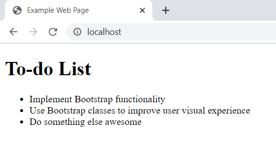

# Introduction

Bootstrap is a popular CSS framework used by many web developers today. A CSS framework is a tool that developers can use to save time and effort in their development. Since Bootstrap is so common, it also provides a common standard for styling that allows for other developers to easily understand what someone's code means and how it functions. This allows for an easy transition should a developer need to hand off a project to someone else.

This page includes a tutorial on how to implement Bootstrap styling into your HTML-based web pages. It requires a basic knowledge of HTML syntax. If you need further understanding of HTML fundamentals, I recommend [this page](https://www.w3schools.com/html/html_intro.asp) from w3schools.com. It's the first HTML resource I ever used, and it explains what HTML elements are and their basic functionality, alongside basic web page structure. Once you've done that, come back here.

## Technologies Used
- [CSS Frameworks](https://medium.com/html-all-the-things/what-is-a-css-framework-f758ef0b1a11)
- [Basic HTML Web Pages](https://www.w3schools.com/html/html_intro.asp)


This tutorial uses direct code copied and pasted from Bootstrap.com to implement stylesheets into HTML. While there are ways to download Bootstrap via zip files, those tutorials are found elsewhere.

# Using Bootstrap

## Enable Bootstrap Functionality
Adding Bootstrap functionality to HTML is actually quite simple. It only requires pasting in a few lines of code to tell the page to load Bootstrap resources.
### CSS
First, move your text cursor in between your `<head>` start and `</head>` end tags in your HTML page, *before* any other stylesheets. Paste the following line of code in:

```
<link rel="stylesheet" href="https://stackpath.bootstrapcdn.com/bootstrap/4.3.1/css/bootstrap.min.css" integrity="sha384-ggOyR0iXCbMQv3Xipma34MD+dH/1fQ784/j6cY/iJTQUOhcWr7x9JvoRxT2MZw1T" crossorigin="anonymous">
```

This will allow the Bootstrap CSS resources to load when the HTML page loads. If the HTML content of a web page is the "skeleton," then the CSS content that you're adding is the "skin," and serves to make the "skeleton" look more presentable.

### JavaScript
You'll also need to add in a few more lines of code to fully enable Bootstrap. Move your text cursor to right before the ending `</body>` tag, and paste these three lines of code in:
```
<script src="https://code.jquery.com/jquery-3.3.1.slim.min.js" integrity="sha384-q8i/X+965DzO0rT7abK41JStQIAqVgRVzpbzo5smXKp4YfRvH+8abtTE1Pi6jizo" crossorigin="anonymous"></script>
<script src="https://cdnjs.cloudflare.com/ajax/libs/popper.js/1.14.7/umd/popper.min.js" integrity="sha384-UO2eT0CpHqdSJQ6hJty5KVphtPhzWj9WO1clHTMGa3JDZwrnQq4sF86dIHNDz0W1" crossorigin="anonymous"></script>
<script src="https://stackpath.bootstrapcdn.com/bootstrap/4.3.1/js/bootstrap.min.js" integrity="sha384-JjSmVgyd0p3pXB1rRibZUAYoIIy6OrQ6VrjIEaFf/nJGzIxFDsf4x0xIM+B07jRM" crossorigin="anonymous"></script>
```
These three lines of code each include additional JavaScript that is necessary to make certain Bootstrap elements function properly. Specifically, the first line implements [jQuery](https://jquery.com/), the second implements [Popper.js](https://popper.js.org/), and the third implements plugins directly from Bootstrap. If you're curious about which elements specifically require these files, you can visit [this link](https://getbootstrap.com/docs/4.3/getting-started/introduction/#js) on Bootstrap's website.

> We're pasting these lines in at the end of the HTML body because this will cause them to load last. When a web page is loading, we want the user to have the visuals on screen as fast as possible, followed by the functionality of those visual aspects. HTML pages load from the top of the code to the bottom. This is why the CSS was pasted first and JavaScript pasted last, as it will load the visual aspects of the HTML code first, followed by the functionality that is implemented with JavaScript. Check the Additional Resources section for more information regarding placement of `<style>` and `<script>` tags.

### Declare HTML5 Doctype
Lastly, you'll need to make sure that you've declared your doctype as HTML5 at the beginning of your HTML code. To do this, you'll also need to add the page language to your `<html>` tag. These two things are pretty simple to implement. Update the beginning of your code to look like this:
```html
<!DOCTYPE html>
<html lang="en">
  Your HTML goes here...
</html>
```
This prevents certain styling from looking strange, as the current Bootstrap builds are made for the HTML5 doctype.
***

## Adding Bootstrap Styling
At this point, you can use Bootstrap styles on any of your HTML elements. The way that Bootstrap styles are implemented are through special Bootstrap CSS classes that can be added to HTML element tags.

If you'd like to follow along, you can use [this link](https://www.w3schools.com/tryit/tryit.asp?filename=tryhtml_default) to access a free online HTML editor (you don't even have to sign up for anything!). Copy the following code and paste it into the editor. This code constitutes a simple web page with the Bootstrap functionality included, but does not utilize Bootstrap in HTML elements yet:
```html
<!DOCTYPE html>
<html lang="en">
    <head>
        <title>Example Web Page</title>
        <link rel="stylesheet" href="https://stackpath.bootstrapcdn.com/bootstrap/4.3.1/css/bootstrap.min.css" integrity="sha384-ggOyR0iXCbMQv3Xipma34MD+dH/1fQ784/j6cY/iJTQUOhcWr7x9JvoRxT2MZw1T" crossorigin="anonymous"> -->
    </head>
    <body>
        <h1>To-do List</h1>
        <ul>
            <li>
                Implement Bootstrap functionality
            </li>
            <li>
                Use Bootstrap classes to improve user visual experience
            </li>
            <li>
                Do something else awesome
            </li>
        </ul>
        <script src="https://code.jquery.com/jquery-3.3.1.slim.min.js" integrity="sha384-q8i/X+965DzO0rT7abK41JStQIAqVgRVzpbzo5smXKp4YfRvH+8abtTE1Pi6jizo" crossorigin="anonymous"></script>
        <script src="https://cdnjs.cloudflare.com/ajax/libs/popper.js/1.14.7/umd/popper.min.js" integrity="sha384-UO2eT0CpHqdSJQ6hJty5KVphtPhzWj9WO1clHTMGa3JDZwrnQq4sF86dIHNDz0W1" crossorigin="anonymous"></script>
        <script src="https://stackpath.bootstrapcdn.com/bootstrap/4.3.1/js/bootstrap.min.js" integrity="sha384-JjSmVgyd0p3pXB1rRibZUAYoIIy6OrQ6VrjIEaFf/nJGzIxFDsf4x0xIM+B07jRM" crossorigin="anonymous"></script>
    </body>
</html>
```
<br>
When displayed on a web browser, the code above looks like this:<br>
<br>

<br>
*Figure 1: Example Web Page without Bootstrap Classes*

Now let's see what happens if we add a Bootstrap class to the list elements. Inside the starting `<ul>` tag, add `class="list-group"`, and in each `<li>` start tag, add the code `class="list-group-item"`.

This adds the Bootstrap class "list-group" to your unordered list element, and the Bootstrap class "list-group-item" to your list items. See how the list looks better formatted:

<br>
*Figure 2: Web Page with Bootstrap List Classes Implemented*

The Bootstrap classes already have their specific CSS modifications made to them, which is why you don't have to include any of your own personal stylesheets for Bootstrap to work.

Let's clean up the page a bit. Around your `<h1>` and `<ul>` tags, add a `<div>` tag that includes the `container` Bootstrap class, as follows:
```html
<div class="container">
    <!-- h1 and ul tags in here... -->
</div>
```

Adding the `<div>` element with the Bootstrap container class around the other elements cleans up the page a bit, constraining the HTML elements inside the `<div>` element into a central area:

<br>
*Figure 3: Web Page Bound by Bootstrap Container*

This makes it look better than it did before, but let's implement one last thing to really make it look nice. Add the following code just after your starting `<body>` tag:
```html
<nav class="navbar navbar-light bg-light">
    <span class="navbar-brand mb-0 h1">My Web Page</span>
</nav>
```

Now your web page has a navbar with some nice CSS formatting already applied to it. Let's see how the final web page product looks:

<br>
*Figure 4: Web Page with Navbar and List Items*

Now we have a decently presentable web page! It doesn't have much functionality yet, but the HTML elements have some pretty nice styling. The best part is, it was *incredibly* easy to add the styling in. Without Bootstrap, we would've had to spend time adding each specific CSS property to each element. Of course, it would have been possible to make our own CSS classes to perform the same functionality that the Bootstrap classes performed, but including Bootstrap classes made the job much easier for us.

For those interested, the completed web page HTML file is included in this Github repository in the `src` file, listed as [index.html](src/index.html).

Now you know the fundamentals for adding Bootstrap class elements to your web pages. To add Bootstrap styling, simply add classes to HTML elements. The [Bootstrap website](https://getbootstrap.com/docs/4.3/components/) provides examples of each type of element that can be modified by Bootstrap classes.

If you've made it this far, you're well on your way to using Bootstrap well in your web pages. Good luck, and happy programming!

***
## Additional Resources
- https://getbootstrap.com/docs/4.3/getting-started/introduction/: If you're still having trouble getting Bootstrap to work on your web page, you can visit this link for a tutorial specifically made for implementing Bootstrap functionality into your web page. It's where I originally learned how to implement Bootstrap, and I found it very useful.
- https://www.w3schools.com/tryit/tryit.asp?filename=tryhtml_default: This is the website that has a free HTML editor. This editor makes it possible to test your own HTML code without any of the complications of setting up an entire website. As it is intended for programmers of any skill level, I highly recommend it for anyone looking to just mess around with HTML and Bootstrap.
- https://medium.com/html-all-the-things/what-is-a-css-framework-f758ef0b1a11: This website has a great overview of what CSS frameworks are and how they fit into a developer's project. The wordage used is at a beginner-to-intermediate level of programming. It's a quick and short read, so it's definitely worth looking at if you're looking for additional insight into CSS frameworks.
- https://www.w3schools.com/html/html_intro.asp: This is the w3schools page referenced in the introduction. It gives an overview of how HTML is used, alongside basic syntax and description of HTML elements. It is written at the level of a beginning programmer, but may be more difficult to understand if the reader does not understand how programming languages work in general.
- https://uxmovement.com/content/why-you-should-place-style-sheets-before-scripts/: This link gives a fantastic explanation of good practice regarding placement of stylesheets and JavaScript in an HTML page. The explanation is short and concise, and quite an easy read in my opinion. It is written at a level that any programmer can understand.
